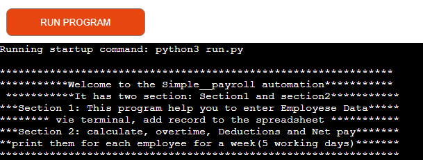
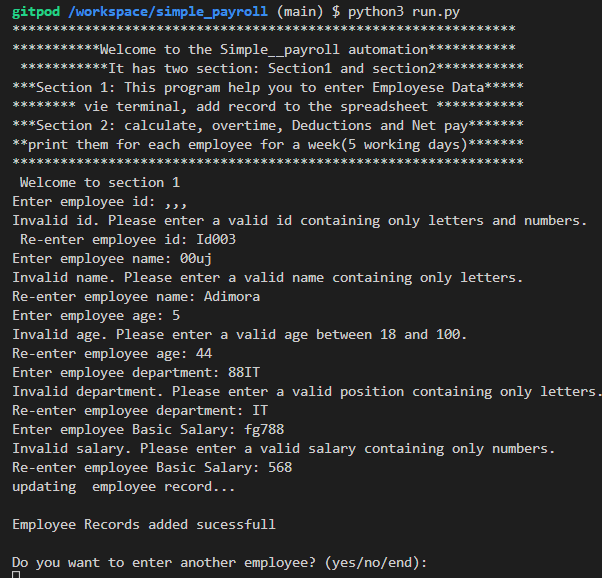
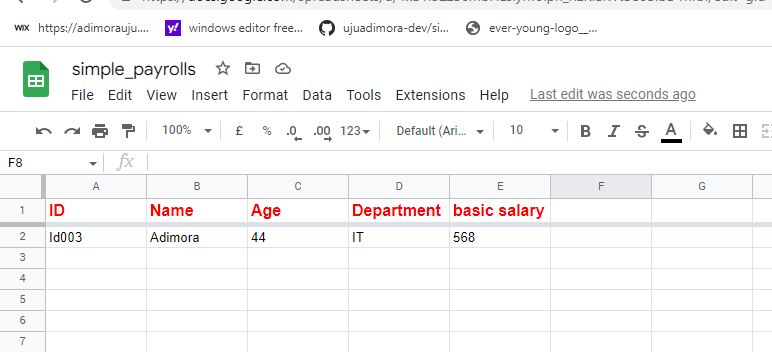
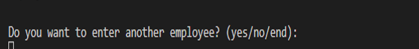
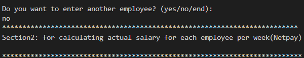
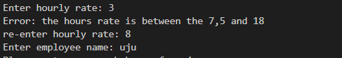
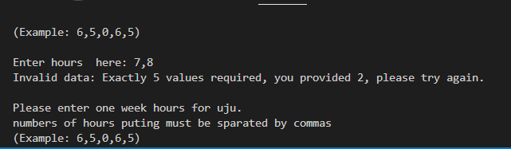

Welcome Adimora Uju Louisa,

 Simple Payroll_automation

 This is a Pay roll program. Users can use this program to enter Employees Record vir terminal that can automatically store  or add in a database( google spread). It has two section. Section one is for employees record that can stored up in a spreadsheet and section two  calcculate work overtime, deduction and  netpay for five(5) working days peintit out in a terminal
"
 [here](https://simple-payroll-system.herokuapp.com/

## Landing Page
* Landing page image
* This will immediately show welcome to the Simple payroll automation as shown here:
* 

![How to Play  Payroll Automation]
# Section1

* In this section, as USER input the name of employee, the system will automatically update or add
the emplyee to the the spreadsheet( Google spreadsheet), These are the field;
Employees Id Number
Employees Name
Employees Age
Employees Department
Employees Salary

There is options for the User to keep on adding the field or not
Each of the field had a validation type:
ID must be aphanumeric data; either number or alpabet 
Name filed is only Alphbet
Age filed is only number( between 18 and 100)
Department field must be Alphbet
Salry filed is  only Number

Any attempt or mistake of putting in the wrong data, will prompt the user and ask the User to reenter
before continuing in the next field- as can be shown below, 
## The input validatation and error Checking

## The record Added automatically as  shown below

## features in these section:
Allow use to reenter filed when wrong data is being enterd
Validate Data
Update automatically to Data Base( in this case Google spread sheet)

If User decided to Add another another, the user will  type "Yes", "end"  means End of the program , when the user type "no" The system will take the user to  Section2 

# Section 2 of the program

Section 2 program calculate employee(workers) overtime hour, Overtime, Basic Salayr and Net Salary 
for period of five(5) working days(week)and print out payment information of the worker vie the Terminal
Field needed here
1. Hourly rate
2. Name of the Employee(worker)
3. 5  working days hours(eg. 6,8,5,7,4)

once the User enter these items and press Enter, The result is as shown belown

There is option for User to decide if to continue calcualting the net  or to end the Progrm

If The User yes, The program for calculating Net Pay will load gain and run
Bet if the user type No, that is the end the program

##The input validatation and error Checking for section2
Hourly Rate(amount of money charge per hour)between 7.5 and 18:

Honur enterd must five in number anseparateded by commas

*	Contact form
*	This contact form is implemented to allow users to contact 'FunTime-Quiz' 
*	Username (is must)
*	Email (a must)
*	Username (is a must;  if the user did not put in his/her name, the system will complain that the name must be writing)
*	Email (a must ;if the user did not put in his/her email and must contain(@), the system will complain that the email with (@) must be writing))
* On successful submission of the contact form, the user will be navigated to Thank.html displaying Thank you message.
*	This will allow to follow on our social media platform

@@ -71,7 +71,7 @@ This page shows the contact form
The  consists of ;
1.Score borad for the Great Score
2. Score board for a poor score or result
3. The user must select option befor going to another question
3. The user must select option before going to another question

@@ -113,8 +113,7 @@ Poor The result or score is when the user score between 0 and 6. As shown below

### Features Left to Implement

* 	As a future enhancement, the contact form will be updated with javascript to send an email to “FunTime-Quiz” with the contact 
    information.
* 	As a future enhancement, the contact form will be updated with to send an email to “FunTime-Quiz 's email” and give the user notification information.
*	There would be dedicated Twitter, youtube, and Facebook handle dedicated to 'FunTime-Quiz'
*	There should Google map showing the location of FunTime-Quiz company
*   Timer  for the quiz will be implemented in the future
@@ -139,8 +138,6 @@ Poor The result or score is when the user score between 0 and 6. As shown below
  

## Technologies

* HTML
@@ -183,7 +180,7 @@ No elements overlap.

Actual:

Website behaved as expected with the exception of switching to landscape view in Mozilla Firefox. 
Website behaved as expected with the exception of switching to landscape . 

Website was also opened on the following devices and no responsive issues were seen:

@@ -209,7 +206,7 @@ Testing was focused to ensure the following criteria were met:

Manual tests were also performed to ensure the website was accessible as possible and an accessibility issue was identified.

Issue : After keyboard controls were implemented, while testing the site with windows 'Narrator' screenreader, it was not clearly known what the purpose of the labels/checkboxes were. An aria-label label was added to the labels for screen readers to alert them that the labels were clickable and what their purpose was. Note:  I was only able to perfoem thise text of th e time factor.
Issue : After keyboard controls were implemented, while testing the site with windows 'Narrator' screenreader, it was not clearly known what the purpose of the labels/checkboxes were. An aria-label label was added to the labels for screen readers to alert them that the labels were clickable and what their purpose was. Note:  I was only able to perform thise text of th e time factor.

### Lighthouse Testing

@@ -239,7 +236,7 @@ Links on all pages navigated to the correct pages as exptected.

**Form Testing**

The form on the contact Home page was tested to ensure it functioned as expected when correct data was input and when incorrect data was input. The following test scenarios were covered:
The form on the  Home page was tested to ensure it functioned as expected when correct data was input and when incorrect data was input. The following test scenarios were covered:

_Scenario One - Correct Inputs_

@@ -255,20 +252,15 @@ Expected:

Form submits with no warnings or errors and the user is redirected to a play.html  page.

_Scenario two -  Inputs(nothing)
1. Navigate to [Home - FunTime-Quiz]( https://ujuadimora-dev.github.io/FunTime-Quiz/)
2. Scroll down to the form and input the following data:
   - First Name: blanK

   - First Name: blanK  
3. Click Submit

Expected:

The form does not submit and an Error is displayed to tell the user that the field is required.

Actual:

Website behaved as expected, error message was displayed and the form did not submit.

@@ -279,9 +271,38 @@ Testing was performed on the Font Awesome Social Media icons in the footer to en
Each item opened a new tab when clicked as expected and correct hover color was present.

**Contact form**
Testing was performed on the contact page . It will navigate the user to 404.html ,if the user inputs the user name or not. Actually it was expected because due to Time factor. As mention in the 404 message. It is still under contruction
Testing was performed on the contact page . It will navigate the user to Thank-you.html , 

## Scenario One - Correct Inputs_

Steps to test:
## If the user inputs the user name and correct email with email format.
Username: Ada
Email; uju@gmail.com
Submit;
on clicking submit, It will navigate the user to Thank-you.html , 

#  Scenario two - blank Inputs_

Steps to test:
But  if the user e.g;
Username:
Email; uju@gmail.com
Submit;
on clicking submit, there will a message telling the user that name filed must not be empty

# Scenario One - in Correct email Inputs_

Steps to test:

But  if the user e.g;
Username: uju
Email; ujugmail.com
Submit;
on clicking submit, there will a message telling the user that email field must contain @ 

# Actual:
Website behaved as expected

### Validator Testing 

@@ -307,7 +328,7 @@ Testing was performed on the contact page . It will navigate the user to 404.htm
 * This is yet to be resolved, but will be address in future due time factor

### Unfixed Bugs
Responsiveness of the website worked on all devices, screen sizes and orientation with the exception of landscape orientation on mozilla firefox. I was unable to resolve this bug on time but will address in a future release.
Responsiveness of the website worked on all devices, screen sizes and orientation with the exception of landscape orientation. it wil be taking care of in future 

## Deployment
