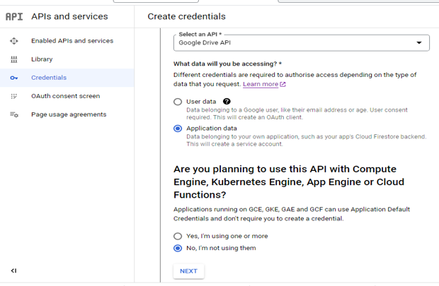

 # Simple Payroll_automation

 This is a Payroll System. Befor embarking on this Project, I had in mind the complicated and repetitive work of Accounting Personnels. Users can use this program to enter Employees Records vir terminal that can automatically store  or add in a database( google spread). Print the paycheck information for Employee(s). There are two sections.  Section one is for employees record that can stored up in a spreadsheet and section two  calculate work overtime, deduction and  netpay for five(5) working days, Print  out  paycheck information of Employee(s) vie  a terminal.
"
 [here live ](https://simple-payroll-system.herokuapp.com/)

## Landing Page
* Landing page image
* This will immediately show welcome to the Simple payroll automation as shown here:
* 

# ![How to Play  Simple Payroll Automation]
## Section1 :  Get Employees Data and add to the spreadsheet

###  In this section, as USER input the name of employee, the system will automatically update 
### or add the emplyee(s) to the the spreadsheet( Google spreadsheet), These  field are;
* Employees Id Number
* Employees Name
* Employees Age
* Employees Department
* Employees Salary

### There is options for the User to keep on adding the field or not
* Each of the field had a validation type:
* ID must be aphanumeric data; either number or alpabet 
* The name filed is only Alphabet (no space)
* Age filed is only number( between 18 and 100)
* Department field must be Alphbet
* Salry filed is  only Number

Any attempt or mistake of putting in the wrong data, will prompt the user and ask the User to reenter
before continuing in the next field- as can be shown below, 

## The input validatation and error Checking

## Then Below is Data input wthout error;

## The record Added automatically as  shown below

* Click here to access my Spreadshee(Google sheeet), (https://docs.google.com/spreadsheets/d/1xB1I5ZzS6MbHEslyMolpn_rIzKIaiWtBeoSIbD1nfbI/edit#gid=1680754323)

## features in these section:
* Allow use to reenter filed when wrong data is being enterd
* Validate Data
* Update automatically to Data Base( in this case Google spread sheet)

## If User decided to Add another another, the user will  type "Yes", "end"  means End of the program , when the user type "no" The system will take the user to  Menu list, to select an option.

# Section 2 of the Project : Get/ calculate Net Pay for Employee(s)

Section 2 program calculate employee(workers) overtime hour, Overtime, Basic Salary and Net Salary 
for period of five(5) working days(week)and print out payment information of the worker vie the Terminal
Field needed here:
1. Hourly rate( Amount Money for hours)
2. Name of the Employee(worker)
3. five(5) working days hours(eg. 6,8,0,7,4) each number for a day hour(s) worked.

# Validation for the filed is as shown below:

once the User enter these items and press Enter, The result is as shown belown

# Below is Data input without errors as shown bleow:

As can be seen above, Paycheck information is printed vie the Terminal.
* Once the User enter the Name of the Employee.
* The rate and number of hours worked. 
* The system will automatically print out The PayCheck information of the Worker.

# Below shows way you can exit the Program:
There is option for User to decide if to continue calcualting the net 
 or return to the  Employee update or exit the program

* If The User yes, The program for calculating Net Pay will load gain and run

# Data Modal and Deign

## .Flowchart: That is the first step. This help  to know the direction am going.

## 2. Google sheet: Here Googlesheet to store the Employee data. In order for python program to access and authentic
* The googlesheet. Below are the steps you need to take:

### Step1: Create project Name: in this name is Simplepayroll( no space in between)

### Step2: create API Libray

## Step3; here is the API Libary Dashboard, Search for Google Drive API and Enable it

## Step4: here create Credential  by clicking CreatCredential button

## Step5: Here create esential Page , select
* Application data
* No , i am not using them
* click Next button

## Step6: Here create Service Account( Admora is the service account here) , then click create and continues

## step7: Click on the service email account

## step8: Here is service email page and click on the key

## step9: Here is Key Page and click ADDKEY, the popup message will comeup and select JSON and create

## step10: The access key will download to your computer, ready to be use

### Then Create Google sheet API and enable it, Through the same way as above
Then share the Google spreadsheet with service accounts that have been created, in the accesskey, as shown below:

## Testing

### The manual testing was carried out by performing the following:
*	Passing the code through PEP8 linder and confirm there is no Problem
*	Given it both valid and invalid data( as mention above), the output was as expected
*	Tested in my local Terminal and at the Code institute Heroku Termial

## Bugs
### Solved Bugs
1. It was not been easy for me, I encounterd so many problems, expeciacially indent issues, 
 while loop issues, validation issues, data not adding to spreadsheet. I have to go back to the drawing borad,
 credit  Sandwiche automation walkthrough Project, i was able to resovled all these problems.

3. Particular issues i have when i wanted to in net_pay function, was giving me a wrong reuslt, I did not structure the loop while

2. I found out that there ware  Logic errors:  while loop is not producing the expected output. I  Try stepping through my code line by line,  using print statements to debug and identify where the error is occurring.

## Remaining Bug
* There is No Bug Remaining

## Validator Tesing
 * Pylint
 * PEP8 linder
 
 ### There was no error found after resoving the following errors below

### Below is the is the Result after resoving the issues

### Features to Implement in Future

* 	As a future enhancement, i would like to be able to add, delect, sort, change Employees record 
    vie Terminal and it will automated be reflected to the datebase.

* 	I would like also in future to be able  to produce Employees record along with their Paycheck 
    information vie the Terminal and it will auomatically update the Database and as well automatically
    notify  or send email to the Employee (s)

  

## Technologies

* Python
* Google Cloud
* Github
* Heroku
* Code Insitute Deployment Terminal

## Deployment

### The project was deployed using Code Institute Mock Terminal for Heroku
#### Step for Deloyment
* The source code deposited in Github
* Log on Heroku
* Create a new app
*  select Setting and configure VAR string
*  Set the buildpack to python and nodejs in that order
* Link Heroku  app to Repoistory( Github)
* Deploy

## Credit
* Code Institute for Mock Terminal and on Google cloud and how to get access privatekey
*  To this https://www.wallstreetmojo.com/payroll-formula/ for the idea how to calulate net pay
*  To this You channel video , i implemented some his idear but in different way: https://www.youtube.com/watch?v=GRqYkz2myJ0&t=46s
*  To  https://stackoverflow.com/ and https://www.w3schools.com/

